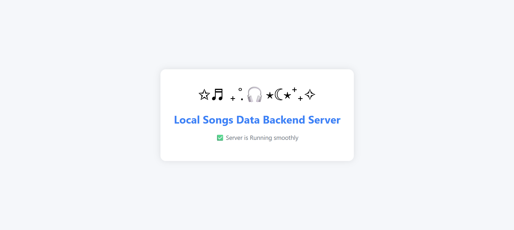

<h1 align="center">🎵 My Songs Data - Backend 🎵</h1>




<p align="center">
  <b>Real-time collaborative music experience backend</b><br/>
  Built with Express.js, MongoDB, and created this as a part of Music API.
</p>

---

## 🚀 Overview

My Songs Data is a Backend API endpoint to:
- 👥 Create and join themed music rooms
- 🔊 Sync playback in real-time with friends
- 💬 Chat, send room requests, and manage connections
- 🎶 Control playback, volume, and song selection together

This repo contains the **Node.js + Express.js** backend powering the Tune Together experience.

---

## 📦 Setup & Installation

### 1. Clone the repo

git clone https://github.com/nryadav18/ps.backend.git
cd ps.backend

### 2. Install dependencies

```bash
npm install
```

### 3. Run the server

npm start or nodemon app.js